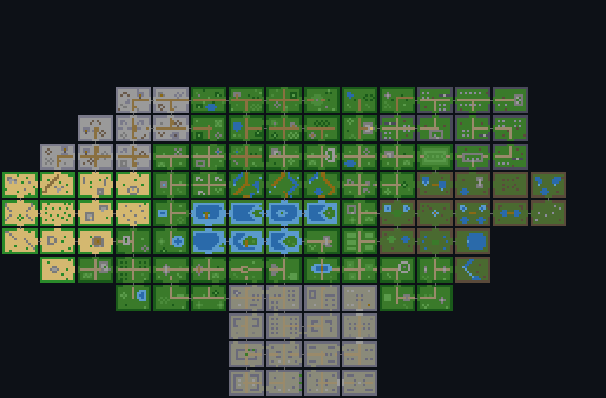
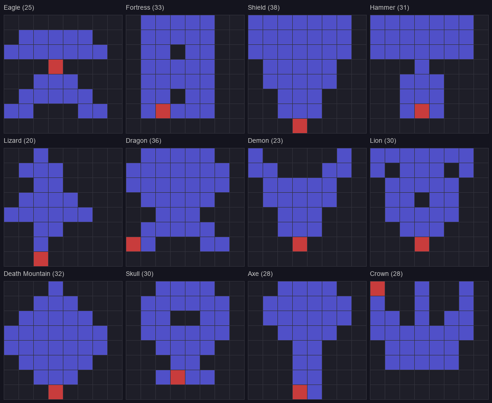

# Legends of Amara

A browser-based multiplayer MUD rendered as a Zelda-style top-down visual game. Players connect via browser, log in with a name and description, explore tile-based rooms with arrow keys or WASD, fight monsters with a sword, delve into procedurally generated dungeons, and chat with AI-powered NPCs through speech bubbles.

## Features

- **Multiplayer exploration** — walk around a 112+ room overworld spanning 9 biomes (forest, mountain, desert, swamp, graveyard, castle, plains, lake, river) plus a hand-crafted village hub
- **NES Zelda-style combat** — sword stab attacks, knockback, invincibility frames, heart-based HP, boss fights with choir music overlays
- **AI-generated dungeons** — procedural dungeon instances with unique monsters, tiles, and room layouts generated by Claude. Content is managed through a library system with daily deprecation and background regeneration
- **Multi-dungeon system** — Dark Dungeon (8x8 layouts, 64 rooms) and Water Temple (3x3 layouts, water mist FX), each with their own boss, treasure room, locked doors, and keys
- **AI-powered NPC chat** — talk to NPCs and they respond in character using LLM backends (Claude CLI, Anthropic API, or a local `llama-server` via [LLMFacade](https://github.com/Coamithra/LLMFacade)). NPCs can give gifts, summon guards, and react to player behavior through a forced-choice classification system
- **Data-driven content** — all tiles, monsters, NPC sprites, and rooms defined in JSON and `.room` files. No hardcoded game content in code
- **Music and atmosphere** — 12+ MP3 tracks with crossfade transitions, biome-specific ambient music, boss battle themes, and choir overlays
- **Player emotes** — `/dance` triggers a looping boogie animation synced across clients

## Screenshots

### World Map


### Dungeon Layouts


## Getting Started

### Prerequisites

- Python 3.12+

### Installation

```bash
pip install -r requirements.txt
```

Dependencies:
- `websockets` 16.0 (pinned; modern `asyncio` server API)
- `anthropic` (optional, for API-based AI generation)
- `llmfacade[llamacpp]` (optional, for local NPC chat via `llama-server`)

### Running

```bash
python mud_server.py
```

Opens on http://localhost:8080. Connect with any modern browser.

### Optional: AI NPC Chat

NPC chat supports three backends, configured via `AI_BACKEND` in `.env`:

| Backend | Config | Notes |
|---------|--------|-------|
| `cli` (default) | Needs `claude` CLI installed | Uses Claude subscription, no API key needed |
| `api` | Set `ANTHROPIC_API_KEY` in `.env` | Direct API calls to Claude Haiku |
| `llamacpp` | Run [`llama-server`](https://github.com/ggml-org/llama.cpp) locally; routed via [LLMFacade](https://github.com/Coamithra/LLMFacade). Override `LLAMACPP_BASE_URL` (default `http://localhost:8080/v1`) and `LLAMACPP_MODEL` to taste. | Fully local, no API key needed |

`AI_BACKEND=ollama` is still accepted as a deprecated alias for `llamacpp` so existing `.env` files keep working — but the request goes through llmfacade against `llama-server`, not Ollama. Old `OLLAMA_URL` / `OLLAMA_MODEL` env vars are no longer read at all — set `LLAMACPP_BASE_URL` / `LLAMACPP_MODEL` instead.

> **Local dev port note:** the game server defaults to port 8080 (`http://localhost:8080`) and `llama-server`'s default is *also* 8080. Run `llama-server` on a different port locally (e.g. `--port 8090`) and set `LLAMACPP_BASE_URL=http://localhost:8090/v1` to avoid the collision. (Production runs the game on 8443/wss, so they don't fight there.)

## Project Structure

```
mud_server.py              # Main entry point
worldgen.py                # Offline world generator
client/                    # Browser client (HTML + JS)
server/                    # Python server modules
  prompts/                 # AI prompt templates
data/                      # Game data (tiles, monsters, NPC sprites)
rooms/                     # .room files (overworld + dungeon templates)
music/                     # MP3 tracks by area
tools/                     # Dev utilities (renderers, content viewer, tests)
docs/                      # Architecture docs and generated images
deploy/                    # Nginx config for production
```

See [docs/ARCHITECTURE.md](docs/ARCHITECTURE.md) for detailed module descriptions.

## Architecture

**Client**: vanilla HTML5 Canvas + WebSocket. All mutable state on a shared `G` namespace. Scripts loaded in dependency order, no build step.

**Server**: async Python with `websockets`. All state on a `GameState` singleton. Server-authoritative with client-side prediction for movement. JSON over WebSocket protocol.

**Game loop**: single synchronous `game_tick()` at ~30Hz. Messages are batched and flushed after each tick to prevent mid-tick race conditions.

## Development Tools

- `python tools/render_map.py` — render world map to PNG (requires Pillow)
- `python tools/content_viewer.py` — browse/generate AI dungeon content on port 8081
- `python tools/test_api_leak.py` — verify API key doesn't leak into CLI subprocesses
- `python tools/download_log.py` — fetch and save server event log

## Hosting

Deployed on a Hetzner CX22 VPS (Ubuntu 24.04) as a systemd service. A local `llama-server` (llama.cpp) handles NPC chat via LLMFacade. See [CLAUDE.md](CLAUDE.md) for deployment details.

## License

All rights reserved.
