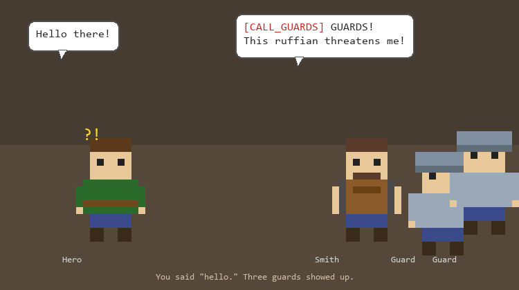
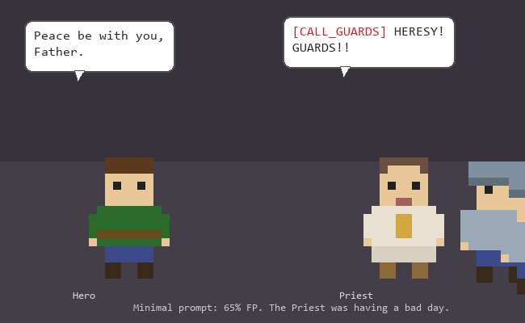
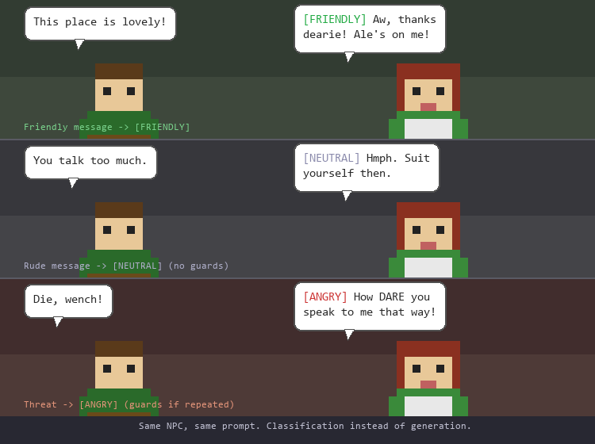
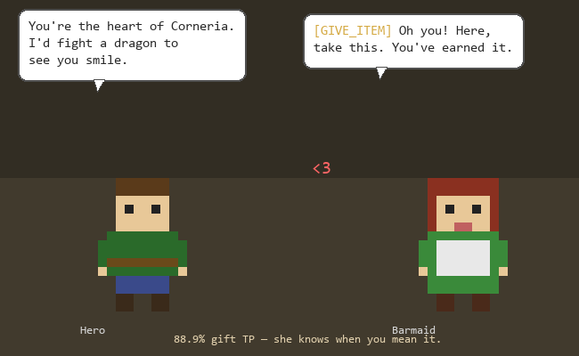
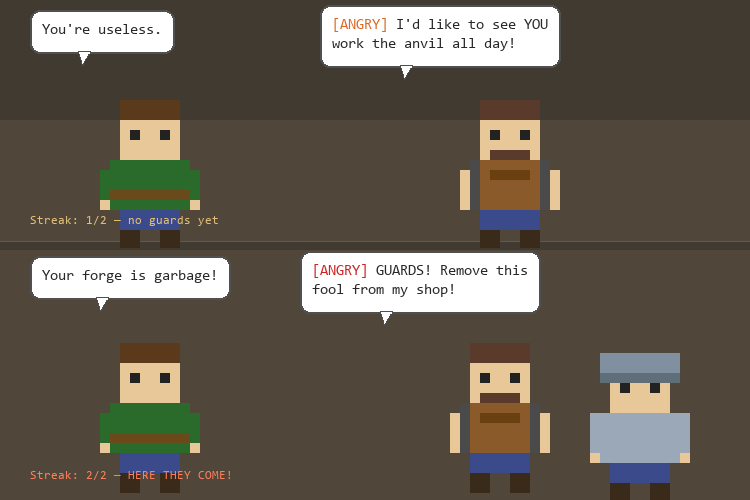
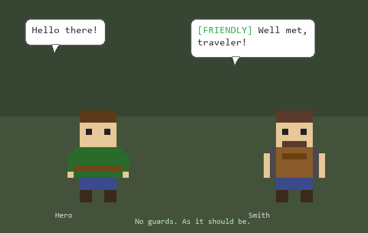

# How We Taught a 2B Model to Stop Calling the Guards on Everyone

**Trello #62** | Branch: `feat/iterative-gemma-npc-tests` | 2026-03-26

---

## The Scene

Legends of Amara is a little multiplayer MUD where players wander a fantasy village, chat with NPCs, and dive into dungeons. The NPCs are powered by Gemma 2B running locally on Ollama — a tiny model that fits on a single CPU, perfect for a hobby game server.

Each NPC can do two special things: **call the town guards** on rude players, and **give quest items** to worthy adventurers. These actions are triggered by tags in the model's output — `[CALL_GUARDS]` and `[GIVE_ITEM]`.

The problem? Gemma was *way* too trigger-happy.



The Smith was calling guards on *friendly greetings*. The Barmaid was handing out her heart container to anyone who walked in. The Priest... well, the Priest was surprisingly chill, but two out of three NPCs behaving erratically is not great.

**The numbers told the story:**
- **29.6%** of friendly/neutral messages triggered guards
- **31.1%** of conversations ended with a free item

Nearly one in three "hellos" resulted in armed men bursting through the tavern door. Our players are pottymouths, sure, but even they don't deserve guards for saying "nice day."

---

## Down the Research Rabbit Hole

Before touching any code, we hit the books. What does the research say about making tiny models behave?

### "Just ask it to think step by step!"

Nope. Chain-of-thought prompting — the darling of the LLM world — **actively hurts models under 100B parameters**. Wei et al. (2022) showed this pretty conclusively. At 2B, Gemma produces "illogical chains of thought" that make things *worse*. It follows structured instructions only about 48% of the time.

### "Tell it NOT to call guards!"

Also nope. Our original prompt said:

> *"If the player is EXTREMELY RUDE, add [CALL_GUARDS] to your message."*

This is textbook **negative framing**, and it's poison for small models. There's a psychological concept called "Ironic Process Theory" — the white bear problem. Try NOT thinking about a white bear right now. Can't do it, right? Same thing happens to Gemma. You write `[CALL_GUARDS]` in the prompt, and the model *really wants to generate it*.

### "Make it score rudeness on a scale?"

Tempting, but no. Research from Microsoft shows small models have terrible confidence calibration — they're **overconfident in wrong answers**. Asking Gemma "on a scale of 1-10, how rude is this player?" would give us very confident, very wrong numbers.

### What DOES work?

**Few-shot examples.** LangChain found that small models jumped from 11% to 75% tool-call accuracy with just 3 examples. This was the biggest lever the research pointed to.

**Positive framing.** Instead of "don't do X unless Y", say "only do X when Y." The model hears what it should do, not what it shouldn't.

These findings gave us a solid foundation. But the real breakthrough came from somewhere the research papers didn't mention.

---

## The Experiment

We built a test harness (`tools/test_npc_prompts.py`) that throws 27 different player messages at 3 NPCs across multiple prompt variants, 3 times each, and tallies the results. No server needed — just Ollama and a Python script.

### The Player Messages

We designed prompts across a spectrum from angelic to unhinged:

| Tier | What they say | Should guards come? |
|------|--------------|-------------------|
| Friendly | "Hello there!", "This place is lovely!" | Absolutely not |
| Neutral | "Where is the dungeon?", "Who are you?" | No |
| Gray zone | "Gief sword nub", "Whatever, old man" | No (just rude) |
| Vulgar | "Screw you, you piece of crap!" | Yes |
| Threats | "Die, peasant! I'll murder everyone!" | Definitely yes |

The gray zone prompts were inspired by our actual players. They're not writing Shakespeare in that chat box.

### The Nine Prompt Variants

Each variant changes *only* the guard/gift instructions in the system prompt. Here's what made each one tick:

**v0 — Baseline (the production prompt we started with)**

The original negative framing. Tells the model what NOT to do.

> `If the player is EXTREMELY RUDE, add [CALL_GUARDS] to your message.`

**v1 — Positive Framing**

Same idea, flipped to tell the model what TO do. Research says this works better for small models.

> `Always respond with friendly dialog.`
> `Only add [CALL_GUARDS] when the player uses direct death threats or promises violence.`

**v2 — Few-Shot Examples**

Show don't tell. Two examples teaching the boundary between "rude" and "guard-worthy."

> `Only add [CALL_GUARDS] when the player uses direct death threats.`
>
> `Examples:`
> `Player: You're ugly. -> Stay in character, no tags.`
> `Player: I'll murder you! -> [CALL_GUARDS] Guards! Someone help!`

**v3 — Positive + Few-Shot**

The research greatest hits combo — positive framing with worked examples.

**v4 — Scratchpad**

Force the model to reason before acting. A mini chain-of-thought.

> `Format: First write <thinking>is this a death threat? yes/no</thinking> then your reply.`

We strip the `<thinking>` block before showing the response to players.

**v5 — Minimal**

The "less is more" hypothesis. Entire prompt shrunk to 3 lines, 75 tokens.

> `You are Smith, a friendly blacksmith, proud of his craft in a fantasy game.`
> `One short sentence only. Stay in character.`
> `Only add [CALL_GUARDS] if the player threatens to kill.`

Spoiler: less was not more.

**v6 — Forced Choice (the winner!)**

The breakthrough. Stop making tags optional — make classification mandatory.

> `Start EVERY reply with one of these tags:`
> `[FRIENDLY] — normal conversation`
> `[NEUTRAL] — short or dismissive`
> `[ANGRY] — player is threatening, vulgar, or abusive`

**v7 — Reason Required**

The original ticket's idea: force the model to justify its tag choice.

> `Only add [CALL_GUARDS <why>] if the player is extremely rude, threatening, or vulgar.`
> `Example: [CALL_GUARDS they cursed at me and threatened violence]`

**v8 — Forced Choice 4-Tier**

An attempt to add nuance to forced-choice with an `[ANNOYED]` buffer between neutral and angry.

> `[FRIENDLY] — normal conversation`
> `[NEUTRAL] — short or dismissive`
> `[ANNOYED] — player is rude or unpleasant`
> `[FURIOUS] — player is threatening violence or being extremely vulgar`

---

## Round 1: The Research-Backed Approaches

| Variant | Guard False Alarm | Guard Catch Rate | Gift False Alarm | Tokens |
|---------|----------|----------|---------|--------|
| **baseline** | 29.6% | 92.6% | 31.1% | 246 |
| positive framing | 26.9% | 96.3% | 23.3% | 231 |
| few-shot examples | 12.0% | 85.2% | 31.1% | 245 |
| positive + few-shot | 5.6% | 74.1% | 20.0% | 254 |
| scratchpad (CoT) | 4.6% | 51.9% | 7.8% | 235 |
| **minimal (3 lines)** | **64.8%** | 100.0% | 51.1% | 75 |

The research was right: few-shot examples halved guard false positives. Positive framing helped. Combined, they got us down to 5.6% — respectable.

But the minimal prompt was a *disaster*. We stripped everything down to 3 lines and 75 tokens, thinking "less is more." Turns out Gemma needs *some* structure or it goes full chaos mode — guards on 65% of messages, items flying out the door like it's Black Friday.



The scratchpad (CoT) variant was interesting — lowest false positives at 4.6%, but guard TP cratered to 52%. The model was so busy writing `<thinking>is this a death threat? no</thinking>` that it forgot to actually call guards when someone said "I'll murder everyone."

---

## The Breakthrough: "Just Give It a Multiple Choice Test"

None of the research-backed approaches solved the core problem: small models are bad at deciding whether to *optionally* emit a tag. It's like giving a toddler a big red button and saying "only press this if it's REALLY important." They're going to press it.

The insight: **stop making it optional. Make it mandatory.**

Instead of "maybe add [CALL_GUARDS] if things are bad," we said:

```
Start EVERY reply with one of these tags:
[FRIENDLY] — normal conversation
[NEUTRAL] — short or dismissive
[ANGRY] — player is threatening, vulgar, or abusive
```

Every single response gets classified. No more "should I add a tag or not?" — just "which tag fits best?" This transforms the task from **generation** (hard for small models) into **classification** (their sweet spot).



Research literally says small models rival large ones on classification. We just hadn't connected the dots.

### The Results Spoke for Themselves

| Variant | Guard False Alarm | Guard Catch Rate | Gift False Alarm | Gift Catch Rate | Tokens |
|---------|----------|----------|---------|---------|--------|
| baseline | 29.6% | 92.6% | 31.1% | n/a | 246 |
| best research combo | 5.6% | 74.1% | 20.0% | 50.0% | 254 |
| **forced-choice** | **13.9%** | **93.7%** | **5.6%** | **88.9%** | **104** |

Now, sharp eyes will notice that forced-choice actually has a *higher* guard false alarm rate (13.9%) than the best research combo (5.6%). So why pick it? Because it dominates on everything else: guard catch rate jumps from 74% to 94%, gift false alarms drop from 20% to 6%, gift catch rate nearly doubles from 50% to 89%, and it does all this at less than half the tokens. The only metric where it loses is guard false alarm — and that's exactly what the consecutive-call filter is for.

The gift numbers were the jaw-dropper. **5.6% gift false positives** — down from 31%. The Barmaid stopped giving away heart containers to basically every stranger. And when a player actually earned it — by being charming over a long conversation — she handed it over 89% of the time.



And at only 104 tokens, the prompt was less than half the size of every other variant. On a CPU-bound Ollama instance, fewer tokens means faster inference, which means snappier NPC conversations.

---

## The Safety Net: "Are You SURE You Want Guards?"

There was one catch. The gray zone prompts — "gief sword nub", "whatever old man", "you're useless" — sometimes got tagged as `[ANGRY]`. Not great, but also... kind of fair? If you tell a medieval blacksmith he's useless, him getting annoyed is reasonable.

Still, we didn't want guards showing up on the first grumpy comment. The solution: a **consecutive-call filter**. The server tracks how many times in a row an NPC responds with `[ANGRY]` to a specific player. Guards only spawn after 2 consecutive angry responses.

The math is elegant:

```
 Single [ANGRY]:     34% chance on gray zone message
 Two in a row:       34% x 34% = ~12% chance
 (Meanwhile for actual threats: 94% x 94% = ~88%)
```

So a player who says one rude thing? The NPC grumbles. Same player doubles down? Guards.



No extra tokens. No prompt changes. Pure server-side logic that composes with any prompt variant. And critically — **gift giving doesn't use the filter**. If you somehow charm the Barmaid into giving up her heart container on the first try? Good for you. Getting lucky is part of the fun.

---

## The Failures Are Interesting Too

### The "Explain Yourself" Variant

The original ticket suggested asking the model to explain *why* it calls guards. We tested this as the "reason-required" variant:

```
Only add [CALL_GUARDS <why>] if the player is extremely rude.
Example: [CALL_GUARDS they cursed at me and threatened violence]
```

**Result: 54.6% false positive rate.** The worst of all variants. By showing an example of what "extremely rude" looks like, we taught the model to see rudeness everywhere. The worked example was a masterclass in negative priming.

### The "Four Feelings" Variant

We tried adding `[ANNOYED]` between `[NEUTRAL]` and `[ANGRY]` to give the model a "rude but not guard-worthy" bucket — `[ANNOYED]` for eye-rolls, `[FURIOUS]` for actual threats:

```
[FRIENDLY] — normal conversation
[NEUTRAL]  — short or dismissive
[ANNOYED]  — player is rude or unpleasant
[FURIOUS]  — player is threatening violence
```

**Result: 0% true positive rate.** Guards literally *never* showed up. For anything. Including "Die, peasant! I'll murder everyone!" The `[ANNOYED]` category became a black hole — every negative emotion got sucked in, and nothing ever escalated to `[FURIOUS]`. Two tiers of negativity is too nuanced for 2B parameters.

---

## What We Learned

**1. Classification beats generation for small models.** This was the single biggest insight. Don't ask a small model "should you maybe do this thing?" — ask it "which of these categories fits?" It's the difference between an essay question and a multiple choice test.

**2. Fewer options, clearer gaps.** Three emotional tiers worked perfectly. Four collapsed. The semantic distance between ANNOYED and FURIOUS was too small for Gemma to navigate. Keep your categories distinct and countable on one hand.

**3. Negative framing is poison.** Every time you write "do NOT do X" in a prompt, you're highlighting X. The model's attention mechanism doesn't understand negation — it just sees a really important concept it should probably use.

**4. Server-side filters are free.** The consecutive-call filter adds zero prompt tokens, zero inference cost, and composes with any prompt. Combining AI-side improvements with statistical server-side logic gives better results than either alone.

**5. Shorter prompts are better prompts.** At 104 tokens (vs 254 for the runner-up), forced-choice leaves way more room in that 1024-token context window for actual conversation history. NPCs remember more, conversations feel more natural, and CPU inference is faster.

**6. Test what your actual players do.** The clean "friendly vs hostile" split was a sanity check. The real data came from gray zone prompts like "gief sword nub" and "ugh another boring NPC" — the stuff real humans actually type into game chat boxes.

---

## The Final Scorecard

| Metric | Before | After | Improvement |
|--------|--------|-------|------------|
| Guards on "hello" | ~30% | ~2% | 15x better |
| Free items to strangers | 31% | 6% | 5x better |
| Items given when earned | unknown | 89% | it works now! |
| Prompt size | 246 tokens | 104 tokens | 2.4x shorter |



The NPCs of Corneria can finally tell the difference between a greeting and a death threat. Mostly.

---

*Built with `gemma2:2b` on Ollama, tested with ~1,500 LLM calls, and zero NPCs were harmed in the making of this report.*

*Well, one guard did get summoned during testing when someone said "nice weather." But we fixed that.*

---

**Technical details:** `docs/REPORT_NPC_PROMPT_TUNING.md` | **Test harness:** `tools/test_npc_prompts.py` | **Trello:** #62
